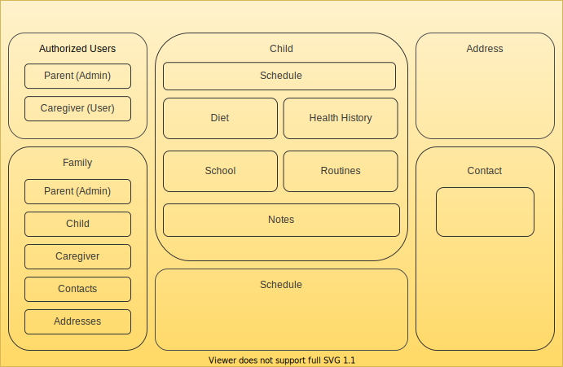

<br />

#### By Julia Seidman
<hr/>

## Description

A React-fronted Web application utilizing a SQL backend built in C#/.Net.  The application provides a platform for organizing important information about a user's children and centralizing communication between caregivers. <br>
Parent users have the ability to share details about their family and children, and allow caregivers access to that information.  Caregivers have the ability to post notes about children for other caregivers and parents to see.
<hr />

## Component Diagrams


<hr/>

## Specifications

||Minimum Product Features|
|-----|-----|
|  |User can register as a parent or caregiver|
|  |User can log in with registered email and password|
|  |User can log out from navigation menu|
|  |Parent can create a Family profile|
|  |Parent can add Children to Family|
|  |Parent can add Caregivers to Family Village|
|  |Parent can edit details for Children|
|  |Caregiver can create personal Contact|
|  |Caregiver can view Families in their Village.|
|  |Caregiver can view details for Children in their Village.|
|  |Caregiver can post notes for Children in their Village.|

<br/>
<br/>

||Stretch Goals|
|-----|-----|
|  |React front end|
|  |Caregivers can be linked to multiple families|
|  |Client and Database are both hosted|
|  |Parents can be linked to multiple families|

<hr />


## Setup/Installation Requirements

1. Clone this projects repository into your local directory following [these](https://www.linode.com/docs/development/version-control/how-to-install-git-and-clone-a-github-repository/) instructions.

2. Open the now local project folder with [VSC](https://code.visualstudio.com/Download) or an equivalent

3. Navigate to the project directory from your terminal by entering the following:

```
$ cd ~/ourVillage
```
4. Within the projects directory install all required dependencies with
```
$ dotnet install
```
5. Run the application to view in your browser with
```
$ dotnet run
```

>If the browser does not automatically launch, view the project [here](https://localhost:8000)

<hr/>

## Known Bugs

### There are no known bugs at this time
If you have a bug or an idea, browse the open issues before opening a new one. You can also take a look at the [Open Source Guide](https://opensource.guide/).

<hr/>

## Technologies Used

- JavaScript
- C#
- .NET Core
- React
- Redux
- Bootstrap
- HTML
- CSS
- Git

<hr/>

## Legal

#### Apache License V2.0

Copyright 2020 Tyler Bates, Julia Seidman, KhanSahab Khakwan @ Epicodus

Licensed under the Apache License, Version 2.0 (the "License");
you may not use this file except in compliance with the License.
You may obtain a copy of the License at

http://www.apache.org/licenses/LICENSE-2.0

Unless required by applicable law or agreed to in writing, software
distributed under the License is distributed on an "AS IS" BASIS,
WITHOUT WARRANTIES OR CONDITIONS OF ANY KIND, either express or implied.
See the License for the specific language governing permissions and
limitations under the License.